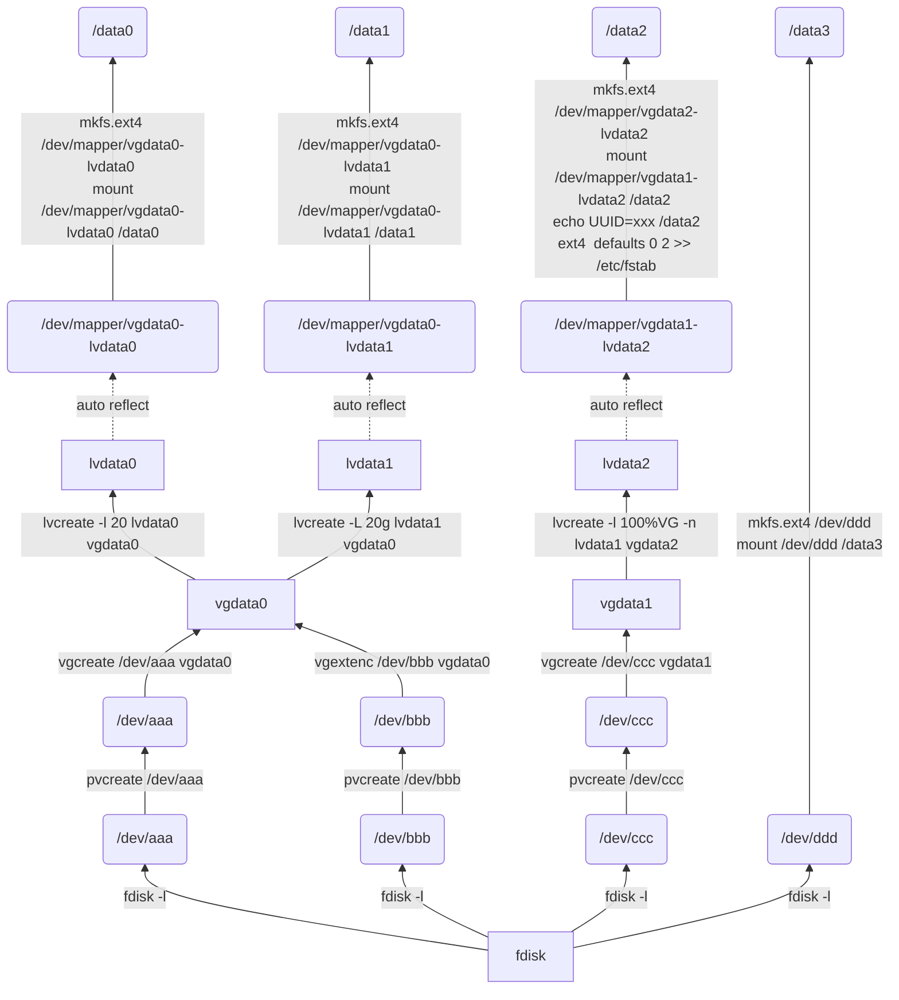

| 命令                                                        | 作用                                                     |
| ----------------------------------------------------------- | -------------------------------------------------------- |
| df -h                                                       | 查看文件系统的挂载情况                                   |
| fdisk -l                                                    | 磁盘使用情况和磁盘分区                                   |
|                                                             |                                                          |
| pvcreate /dev/aaa                                           | 创建/dev/aaa物理卷                                       |
| pvremove /dev/aaa                                           | 删除物理卷                                               |
| pvscan、pvs                                                 | 查看物理卷的简要信息                                     |
| pvdisplay /dev/aaa                                          | 查看/dev/aaa物理卷的详细信息，不指定则显示所有物理卷     |
|                                                             |                                                          |
| vgcreate vgdata /dev/aaa /dev/bbb                           | 使用/dev/aaa、/dev/bbb，创建名为vgdata的卷组             |
| vgextend vgdata /dev/ccc                                    | 将/dev/ccc物理卷添加到vgdata中                           |
| pvmove /dev/aaa /dev/ccc                                    | 将/dev/aaa的数据迁移至/dev/ccc                           |
| vgreduce vgdata /dev/aaa                                    | 将/dev/aaa从vgdata中删除                                 |
| vgscan、vgs                                                 | 查看卷组的简要信息                                       |
| vgdisplay vgdata                                            | 查看vgdata卷组的详细信息，不指定则显示所有卷组的详情     |
|                                                             |                                                          |
| lvcreate -l 100%VG -n lvdata vgdata                         | 使用vgdata剩余空间，创建名为lvdata的逻辑卷               |
| lvcreate -l 20 lvdata vgdata                                | 使用vgdata剩余的20PE空间，创建lvdata，PE则使用-l         |
| lvcreate -L 20G lvdata vgdata                               | 使用vgdata剩余20g的空间，创建lvdata，大小使用-L          |
| lvextend -l +100%FREE /dev/mapper/vgdata-lvdata             | 将vgdata的剩余空间加到lvdata上                           |
| lvscan、lvs                                                 | 查看逻辑卷的简要信息                                     |
| lvdisplay lvdata                                            | 查看lvdata逻辑卷的详细信息，不指定则显示所有逻辑卷的详情 |
|                                                             |                                                          |
| mkfs.ext4 /dev/mapper/vgdata-lvdata                         | 使用ext4格式，格式化名为/dev/mapper/vgdata-lvdata的分区  |
| resize2fs /dev/mapper/vgdata-lvdata                         | 调正分区的大小                                           |
| blkid /dev/mapper/vgdata-lvdata                             | 查看分区的UUID等信息                                     |
| mount /dev/mapper/vgdata-lvdata /data                       | 将分区挂载到/data目录上，系统重启需要重新挂载            |
| echo "UUID=45332b5a /data ext4  defaults 0 2" >> /etc/fstab | 将UUID对应的分区挂载到/data目录上，重启不需要重新挂载    |

