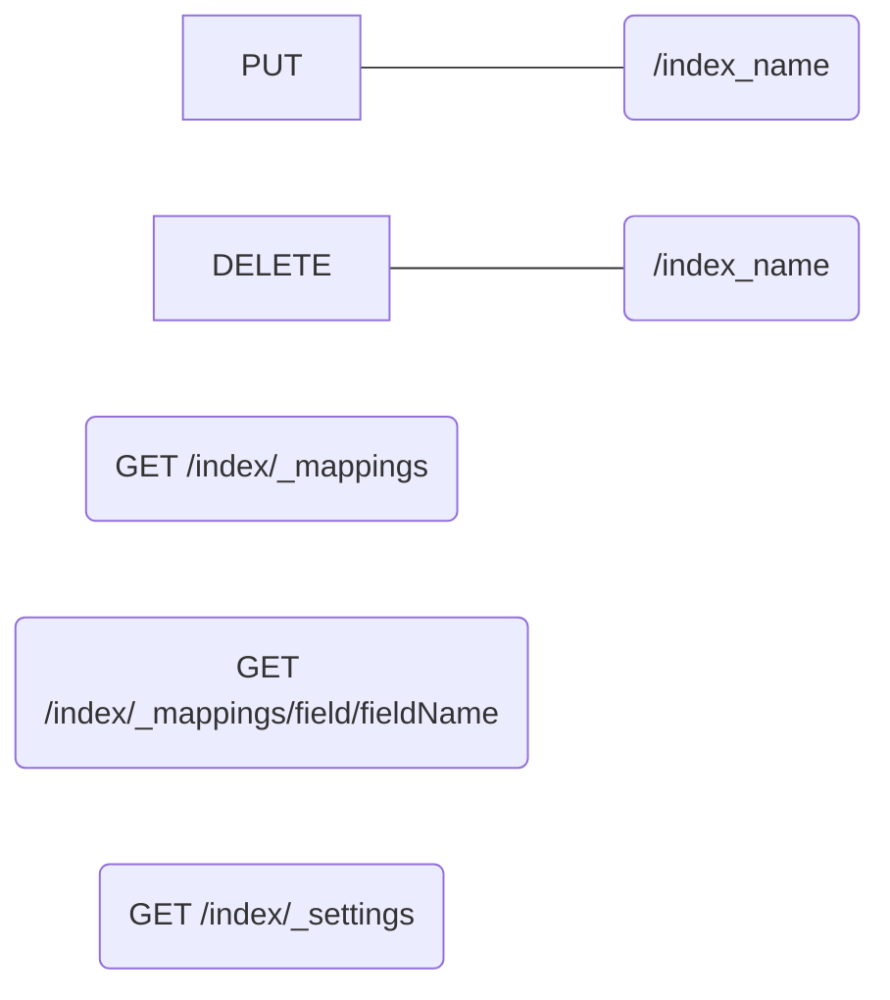
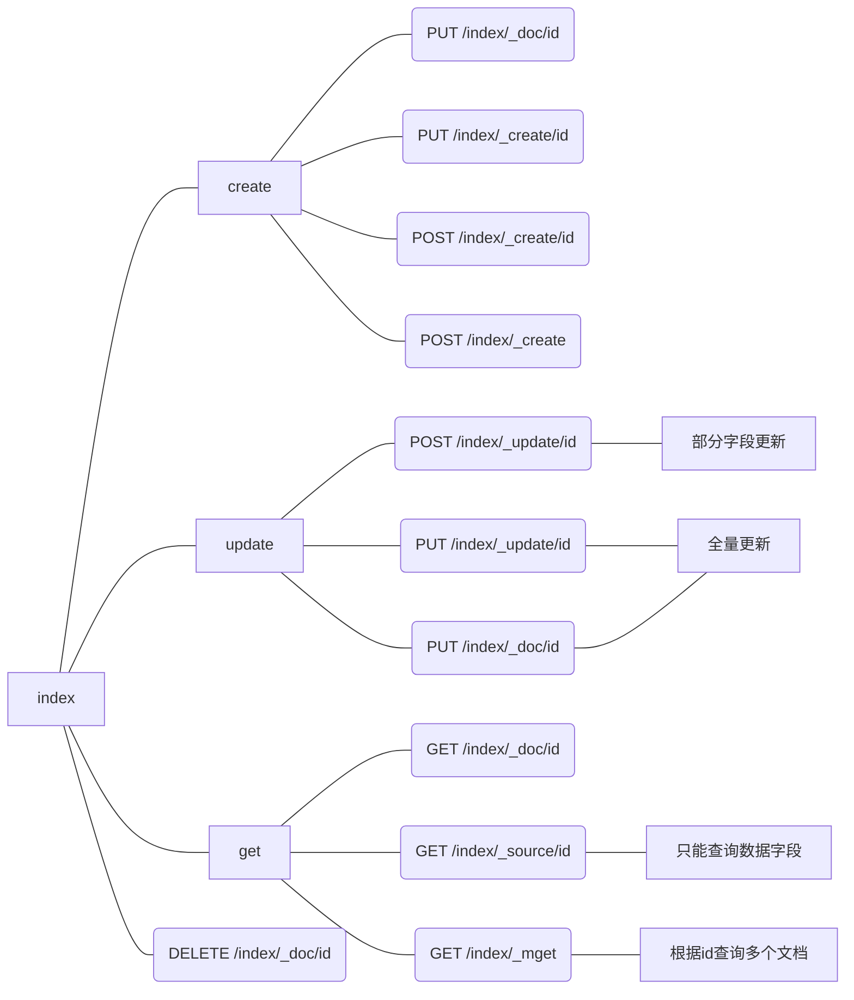

## 下载安装

### 下载

官网的下载地址：`https://www.elastic.co/cn/downloads/elasticsearch`


根据自己的操作系统选择适合的版本，因为我的系统是Ubuntu 20.04，所以选择Linux X86-64的压缩包。


这里我使用的是elasticsearch 7.x的最后一个稳定版本，8.x怕有一些兼容性问题，api也不一定完善。所以还是用上一个大版本的最后一个稳定版本。

```shell
# 下载
wget https://artifacts.elastic.co/downloads/elasticsearch/elasticsearch-7.17.9-linux-x86_64.tar.gz

# 解压
tar -xvf elasticsearch-7.17.9-linux-x86_64.tar.gz
```


解压完进入安装包里面，看下目录结构

> root@ubuntu:/data# cd elasticsearch-7.17.9/
> root@ubuntu:/data/elasticsearch-7.17.9# ls
> bin  config  jdk  lib  LICENSE.txt  logs  modules  NOTICE.txt  plugins  README.asciidoc


- bin：es的启动脚本等
- config：es的配置文件
- jdk：默认自带jdk，如果系统有`JAVA_HOME`的话，会使用`JAVA_HOME`
- lib：es所以来的Java库，如lucene
- logs：日志目录，有es的基本日志，也有gc日志等。
- module：es的模块，如Cluster，Discovery，Indices
- plugins：已经安装的插件目录
- LICENSE.txt：elastic的许可说明
- README.asciidoc：readme说明文件，正常人谁看这个。。


### 启动

进入bin目录，先看下有哪些脚本

> root@ubuntu:/data/elasticsearch-7.17.9/bin# ls
> elasticsearch           elasticsearch-croneval       elasticsearch-keystore  elasticsearch-saml-metadata    elasticsearch-sql-cli             x-pack-env
> elasticsearch-certgen   elasticsearch-env            elasticsearch-migrate   elasticsearch-service-tokens   elasticsearch-sql-cli-7.17.9.jar  x-pack-security-env
> elasticsearch-certutil  elasticsearch-env-from-file  elasticsearch-node      elasticsearch-setup-passwords  elasticsearch-syskeygen           x-pack-watcher-env
> elasticsearch-cli       elasticsearch-geoip          elasticsearch-plugin    elasticsearch-shard            elasticsearch-users


很多脚本我也不大会用，但这个`elasticsearch`的文件，就是ES的启动脚本，直接`./elasticsearch`启动即可


会报一个root用户不能启动的错误，直接用root启动只是方便而已，但是会有安全问题

> java.lang.RuntimeException: can not run elasticsearch as root
>         at org.elasticsearch.bootstrap.Bootstrap.initializeNatives(Bootstrap.java:107)
>         at org.elasticsearch.bootstrap.Bootstrap.setup(Bootstrap.java:183)
>         at org.elasticsearch.bootstrap.Bootstrap.init(Bootstrap.java:434)
>         at org.elasticsearch.bootstrap.Elasticsearch.init(Elasticsearch.java:169)
>         at org.elasticsearch.bootstrap.Elasticsearch.execute(Elasticsearch.java:160)
>         at org.elasticsearch.cli.EnvironmentAwareCommand.execute(EnvironmentAwareCommand.java:77)
>         at org.elasticsearch.cli.Command.mainWithoutErrorHandling(Command.java:112)
>         at org.elasticsearch.cli.Command.main(Command.java:77)
>         at org.elasticsearch.bootstrap.Elasticsearch.main(Elasticsearch.java:125)
>         at org.elasticsearch.bootstrap.Elasticsearch.main(Elasticsearch.java:80)
> For complete error details, refer to the log at /data/elasticsearch-7.17.9/logs/elasticsearch.log


切换到系统自带的用户，也可以创建专门的用户，并对es的安装目录进行授权

```sh
# 切换账户，也可以自己创建新账户
su ubuntu

# 授权，sudo需要输入密码
sudo chown -R ubuntu /data

# 切换到es的bin目录
cd /data/elasticsearch-7.17.9/bin/

# 启动es
./elasticsearch

# 后台进程启动的话，需要加个-d，如
./elasticsearch -d
```


es启动比较耗资源，需要等个几十秒。

如果没有明显的报错，并且打印了`node  started`相关的日志，那么说明启动成功

> [2023-04-05T15:15:52,306][INFO ][o.e.n.Node               ] [node-1] started


新开一个窗口，用curl掉一下es的端口，验证一下

> root@ubuntu:~# curl localhost:9200
> {
>   "name" : "ubuntu",
>   "cluster_name" : "elasticsearch",
>   "cluster_uuid" : "JkpJ6HiHSiKco3J1rPFSWg",
>   "version" : {
>     "number" : "7.17.9",
>     "build_flavor" : "default",
>     "build_type" : "tar",
>     "build_hash" : "ef48222227ee6b9e70e502f0f0daa52435ee634d",
>     "build_date" : "2023-01-31T05:34:43.305517834Z",
>     "build_snapshot" : false,
>     "lucene_version" : "8.11.1",
>     "minimum_wire_compatibility_version" : "6.8.0",
>     "minimum_index_compatibility_version" : "6.0.0-beta1"
>   },
>   "tagline" : "You Know, for Search"
> }


如果启动出现这个报错

> ERROR: [1] bootstrap checks failed. You must address the points described in the following [1] lines before starting Elasticsearch.
> bootstrap check failure [1] of [1]: max virtual memory areas vm.max_map_count [65530] is too low, increase to at least [262144]


那么需要改下系统的配置

```sh
echo "vm.max_map_count=655360" >> /etc/sysctl.conf
sysctl -p

PUT /_cluster/settings
{
    "persistent": {
        "cluster": {
            "max_shards_per_node": 10000
        }
    }
}
```


### 配置

因为我是用虚拟机启动的ES，和我本地Windows不是同一台机器，所以在浏览器访问ES，会出现访问不通的情况。

另外，在一些内存比较小的机器，也应该适当限制一些ES的堆内存大小，以减少内存占用。


所以看下ES配置文件

> ubuntu@ubuntu:/data/elasticsearch-7.17.9/config$ ls
> elasticsearch.keystore  elasticsearch-plugins.example.yml  elasticsearch.yml  jvm.options  jvm.options.d  log4j2.properties  role_mapping.yml  roles.yml  users  users_roles


- elasticsearch.yml：为ES的主配置文件

- jvm.options：为ES的Java虚拟机配置文件


修改elasticsearch.yml中的IP配置，以打开外部访问

```yaml
# 本机的ip地址，应该使用linux系统的网卡IP
network.host: 192.168.0.100
# 集群服务器的ip和端口，因为单机，所以只有一个
discovery.seed_hosts: ["192.168.0.100:9300"]
# 节点的名称，随意
node.name: node-1
# 集群的master节点，因为单机，所以只有一个
cluster.initial_master_nodes: ["node-1"]
```


修改jvm.options的堆内存大小设置，以限制占用的内存。

```sh
# 允许使用的最大堆内存
-Xmx1g
# 允许使用的最小堆内存，设置成最大一样的，防止JVM自动调整
-Xms1g
```


修改完成后再启动es，就能通过浏览器就能够访问es了。

但是别人也可以访问到es，说不定还会删掉我们的一些数据，所以，最好还得设置一下es的密码。**安全问题千万不能忽视。**


在elasticsearch.yml中增加如下安全配置

```yaml
xpack.security.enabled: true
xpack.security.transport.ssl.enabled: true
```


然后使用工具创建账号密码，工具在es的bin目录中

```sh
./elasticsearch-setup-passwords auto
```


按照提示输入y，然后自动生成密码。如果需要手动设置，那么应该使用`./elasticsearch-setup-passwords interactive`

以下是自动生成的密码。

> Initiating the setup of passwords for reserved users elastic,apm_system,kibana,kibana_system,logstash_system,beats_system,remote_monitoring_user.
> The passwords will be randomly generated and printed to the console.
> Please confirm that you would like to continue [y/N]y
>
>
> Changed password for user apm_system
> PASSWORD apm_system = rHr4bgKGvkAt9YfU7E05
>
> Changed password for user kibana_system
> PASSWORD kibana_system = RSNeo5gQ5cqG13ACffpP
>
> Changed password for user kibana
> PASSWORD kibana = RSNeo5gQ5cqG13ACffpP
>
> Changed password for user logstash_system
> PASSWORD logstash_system = OJywk34QyDzrInlnEYaP
>
> Changed password for user beats_system
> PASSWORD beats_system = KiS6dxeGCm4sX8fSlf5y
>
> Changed password for user remote_monitoring_user
> PASSWORD remote_monitoring_user = FUKJ7soZdNLPVxKh6TYa
>
> Changed password for user elastic
> PASSWORD elastic = IQtX9FoHb5iSZZjgzSae


> Unexpected response code [503] from calling PUT http://ip:9200/_security/user/apm_system/_password?pretty
> Cause: Cluster state has not been recovered yet, cannot write to the [null] index
>
> Possible next steps:
> * Try running this tool again.
> * Try running with the --verbose parameter for additional messages.
> * Check the elasticsearch logs for additional error details.
> * Use the change password API manually. 
>
>
> ERROR: Failed to set password for user [apm_system].


## 索引结构


### settings

number_of_shards：主分片数量，只能在创建索引时设置，默认为1。

number_of_replicas：主分片的副本数。默认为 1，允许配置为 0。

refresh_interval：写入罗盘的频率，默认为1， 可以设置 -1 为禁用刷新。

max_result_window：from + size搜索此索引 的最大值，默认为10000，为安全和性能设置。


### mappings

映射字段对应的数据类型

- dynamic mapping

如果没有指定具体字段的数据类型的话，ES会根据第一条数据的数据类型，进行动态映射。


- Explicit mapping


- 索引操作




## 文档操作

- 文档的数据结构

```json
{
    "_index": "索引名称",
    "_id": "文档id",
    "_version": "文档版本号",
    "_seq_no": "索引级别的版本号，索引中所有文档共享一个",
    "_primary_term": "集群任期",
    "_source": {
        "具体的业务字段":"具体的业务数据"
    }
}
```


- 文档的基础操作



### 创建文档

ES有两种创建文档的HTTP方法，分别是POST和PUT。

两种创建方法的区别在于，PUT请求在语义要求**幂等性**，所以在创建文档的时候，ES需要知道你究竟是要创建哪一条文档？**PUT请求需要指定文档的Id**。而POST请求，则没有幂等性的要求，如果在URL中指定文档的Id，则原先没有这条Id的记录则进行创建，有这条Id的记录则进行更新。POST请求没有指定文档Id的情况下，ES会自动生成一个随机字符串作为Id。


 所以，两种的URL规则为

- PUT
  - `/<index>/_doc/<id>`，没有则创建，有则全量更新。
  - `/<index>/_create/<id>`，创建文档，如果已有则报错。使用`_create`代替`_doc`。
- POST
  - `/<index>/_doc/<id>`，没有则创建，有则全量更新。
  - `/<index>/_doc`，创建文档，Id随机。


### 修改文档

与创建一样，修改文档也可以使用POST和PUT请求，并且也可以使用`_update`代替`_doc`，如

- PUT

  - `/<index>/_doc/<id>`，全量更新

- POST

  - `/<index>/_doc/<id>`，全量更新

  - `/<index>/_update/<id>`，可全量更新，可部分更新。语法如下

    ```json
    {
        "doc": {
            "部分更新的字段": "字段的具体数值"
        }
    }
    ```


### 查询文档

根据Id查，指定查询的字段，根据Id批量查询


### 删除文档


