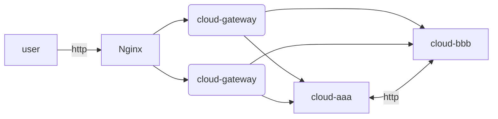

大家好呀，想必大家平时刷牙洗脸做饭的时候，经常会遇到Http接口的监控问题。

如何知道自己写的Http接口，它的访问量、访问耗时是多少呢？

我这里呢，分享一下我实现的方案。

### 系统架构

1、用户通过最外层的网关访问Nginx集群

2、Nginx转发到微服务网关

3、微服务网关再通过uri识别，转发到对应的微服务上，如cloud-aaa，cloud-bbb

4、cloud-aaa和cloud-bbb之间，可以通过http接口互相调用

### 方案分析

#### 基于Nginx插件

思路：编译一个Nginx的接口监控插件，然后通过Prometheus进行采集，用Grafana进行展示

缺点：

1、只能够监控到最外层的Http请求，不能够监控到微服务互调的Http请求

2、Nginx编译有一定复杂性，不确定是否能编译成功，不确定后续是否稳定

3、不确定方案是否能够实现，需要进行验证

4、可能会造成Nginx节点的CPU和内存使用增加，负载变大

#### 基于微服务网关

思路：在微服务网关进行监控，如Spring类型的微服务，在Http拦截器中，获取接口的URI和耗时等，然后存入数据库中，用Grafana查询数据库进行展示

缺点：

1、只能够监控到最外层的Http请求，微服务的互相调用不一定能经过网关，所以不能够监控到微服务互调的Http请求

#### 基于SDK埋点

思路：我们每个微服务都会依赖我们自己写的一个common的依赖包，这个依赖包封装了SpringMVC模块。在这个common的依赖包里面，写一个Http的拦截器，然后获取URI和耗时，然后存储数据库中。

缺点：

1、对于微服务而言，强制依赖了监控所需要的数据库。如监控数据存到Elasticsearch中，那么对于微服务来说，会增加ES的依赖。

2、在核心的SDK层面做拦截，万一出错，非常影响业务。

3、扩展性不够强，如果以后将微服务将SpringCloud的RPC调用由Feign改成Dubbo，那么也需要在Dubbo的拦截器中实现类似的逻辑。

#### 基于日志分析

思路：微服务将每个HTTP接口的访问时间、耗时等，按照一定的规则，打印到对应的目录文件上，然后通过filebeats进行采集到Elasticsearch中 ，再通过Grafana进行展示。

优缺点：目前这个是我想到的，比较好的方案了。基于日志的方式，对业务的侵入性比较低。但是需要微服务按照一定的规则打印日志。但是吧，接口监控是开发工程师、运维工程师都需要参与的事情，不算太麻烦，觉得对开发工程师也是可以接受的。

### 基于SDK埋点实现

基于SDK埋点有没有可能存在问题？

因为我们在上述的方案分析中，是计划使用Elasticsearch进行数据存储的，而ES通过什么协议进行读写呢？

HTTP！这里面存在的问题是，如果每一个接口的监控数据都直接发送到ES中，那么在接口的并发量很大的情况下，ES将承受同等的并发。这里不是怀疑ES的读写性能，只是HTTP协议是一个性能比较低的协议，服务的并发数确实是有一定上限的。

监控服务不是核心业务，所以尽量不要让监控的功能，影响到相关的组件。有这种可能性的话，也应该尽可能降低影响。

所以，我们在编码实现的过程中，需要做一些优化。

优化的思路也非常简单，将每一秒的数据先进行预处理，统计出相关的维度，再以秒为单位存入到ES中。如果有上千个接口，那么一秒钟最多也只有上千个并发打到ES上。

### 基于日志实现

### Grafana指标展示

