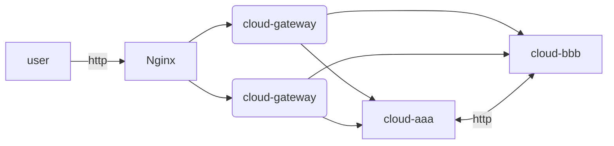
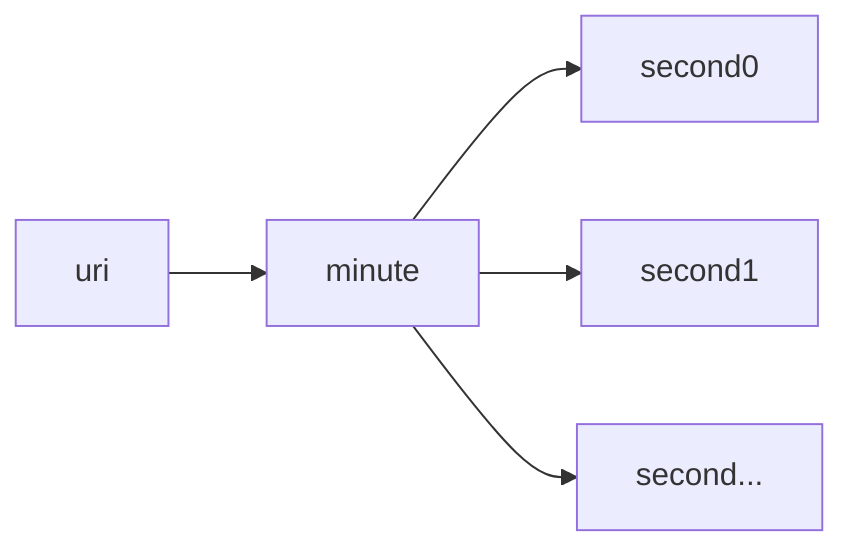

大家好呀，想必大家平时刷牙洗脸做饭的时候，经常会遇到Http接口的监控问题。

如何知道自己写的Http接口，它的访问量、访问耗时是多少呢？

我这里呢，分享一下我实现的方案。


### 系统架构



1、用户通过最外层的网关访问Nginx集群

2、Nginx转发到微服务网关

3、微服务网关再通过uri识别，转发到对应的微服务上，如cloud-aaa，cloud-bbb

4、cloud-aaa和cloud-bbb之间，可以通过http接口互相调用


### 方案分析

#### 基于Nginx插件

思路：编译一个Nginx的接口监控插件，然后通过Prometheus进行采集，用Grafana进行展示


缺点：

1、只能够监控到最外层的Http请求，不能够监控到微服务互调的Http请求

2、Nginx编译有一定复杂性，不确定是否能编译成功，不确定后续是否稳定

3、不确定方案是否能够实现，需要进行验证

4、可能会造成Nginx节点的CPU和内存使用增加，负载变大


#### 基于微服务网关

思路：在微服务网关进行监控，如Spring类型的微服务，在Http拦截器中，获取接口的URI和耗时等，然后存入数据库中，用Grafana查询数据库进行展示


缺点：

1、只能够监控到最外层的Http请求，微服务的互相调用不一定能经过网关，所以不能够监控到微服务互调的Http请求


#### 基于SDK埋点

思路：我们每个微服务都会依赖我们自己写的一个common的依赖包，这个依赖包封装了SpringMVC模块。在这个common的依赖包里面，写一个Http的拦截器，然后获取URI和耗时，然后存储数据库中。


缺点：

1、对于微服务而言，强制依赖了监控所需要的数据库。如监控数据存到Elasticsearch中，那么对于微服务来说，会增加ES的依赖。

2、在核心的SDK层面做拦截，万一出错，非常影响业务。

3、扩展性不够强，如果以后将微服务将SpringCloud的RPC调用由Feign改成Dubbo，那么也需要在Dubbo的拦截器中实现类似的逻辑。


#### 基于日志分析

思路：微服务将每个HTTP接口的访问时间、耗时等，按照一定的规则，打印到对应的目录文件上，然后通过filebeats进行采集到Elasticsearch中 ，再通过Grafana进行展示。


优缺点：目前这个是我想到的，比较好的方案了。基于日志的方式，对业务的侵入性比较低。但是需要微服务按照一定的规则打印日志。接口监控是开发工程师、运维工程师都需要参与的事情，不算太麻烦，觉得对于开发工程师也是可以接受的。


### 基于SDK埋点实现

基于SDK埋点有没有可能存在问题？

因为我们在上述的方案分析中，是计划使用Elasticsearch进行数据存储的，而ES通过什么协议进行读写呢？

HTTP！这里面存在的问题是，如果每一个接口的监控数据都直接发送到ES中，那么在接口的并发量很大的情况下，ES将承受同等的并发。这里不是怀疑ES的读写性能，只是HTTP协议是一个性能比较低的协议，服务的并发数确实是有一定上限的。

监控服务不是核心业务，所以尽量不要让监控的功能，影响到相关的组件。有这种可能性的话，也应该尽可能降低影响。


所以，我们在编码实现的过程中，需要做一些优化。

优化的思路也非常简单，将每一秒的数据先进行预处理，统计出相关的维度，再以秒为单位存入到ES中。如果有上千个接口，那么一秒钟最多也只有上千个并发打到ES上。W


这里用脑图整理一下实体类的关系

一个接口，URI，虽然我们只需要计算秒的数据，但是，并不一定接口的请求都能在一秒内进行响应。假设Http接口的超时时间是30秒，那么最差的情况下，要存储30秒的Http的数据。

所以最好抽象出分钟的概念，来包含秒，方便对秒进行管理。

所以实体类的接口是，有很多个接口（URI），每个接口我们只存储最近1分钟的数据（Minute），而实际存储的是具体一秒钟的数据（Second）



这里面有一段代码是比较晦涩的，因为包含了时间轮算法

大概的思想是这样的，因为有些接口的耗时会比较长，所以需要存储前十几秒的数据，等接口超时完了，在进行统计。


- 接口拦截器

```java
@Slf4j
@Component
@RequiredArgsConstructor
public class DefaultRequestCompleteCallbackServiceImpl implements RequestCompleteCallbackService {

    private final HttpUris httpUris;
    
@Override
    public void callback(HttpServletRequest request, HttpServletResponse response, Object handler, Exception ex) throws Exception {
        ...
        try {
            long start = (Long) request.getAttribute(HttpInterceptor.START_TIME);
            long end = System.currentTimeMillis();
            httpUris.cal(request.getRequestURI(), start, Long.valueOf(end - start).intValue());
        } catch (Exception exp) {
            log.error("http stats encounter error , when uri={}", request.getRequestURI(), exp);
        }
		...
    }
}
```


- 实体类URI的具体代码

```java
@Slf4j
@Component
@RequiredArgsConstructor
public class HttpUris {
    private final HttpStatsRepository httpStatsRepository;
    // URL-->minute
    private ConcurrentHashMap<String, HttpMinuteStats> map = new ConcurrentHashMap<>();
    
    @Value("${spring.application.name:default}")
    private String serviceName;

    @PostConstruct
    public void init() {
        Executors.newScheduledThreadPool(1).scheduleAtFixedRate(new Thread(() -> {
            ConcurrentHashMap.KeySetView<String, HttpMinuteStats> uris = map.keySet();
            for (String uri : uris) {
                HttpMinuteStats httpMinuteStats = map.get(uri);
                httpMinuteStats.reset(uri,serviceName);
            }
        }, "http-stats-reset-thread"), 0, 1, TimeUnit.SECONDS);

        Executors.newScheduledThreadPool(1).scheduleAtFixedRate(new Thread(() -> {
            ConcurrentHashMap.KeySetView<String, HttpMinuteStats> uris = map.keySet();
            LocalDateTime localDateTime = LocalDateTime.now().plusSeconds(-30);
            for (String uri : uris) {
                HttpMinuteStats httpMinuteStats = map.get(uri);
                HttpSecondStats secondStats = httpMinuteStats.getSecondStats(localDateTime.getSecond());
                httpStatsRepository.save(secondStats);
            }
        }, "http-stats-db-thread"), 30, 1, TimeUnit.SECONDS);
    }

    private HttpSecondStats getSecondStats(String uri, Integer seconds) {
        if (map.containsKey(uri)) {
            HttpMinuteStats httpMinuteStats = map.get(uri);
            return httpMinuteStats.getSecondStats(seconds);
        }
        return null;
    }

    private Boolean contains(String uri) {
        return map.containsKey(uri);
    }

    private synchronized void put(String uri) {
        if (!map.containsKey(uri)) {
            HttpMinuteStats minuteStats = new HttpMinuteStats();
            minuteStats.init(uri,serviceName);
            map.put(uri, minuteStats);
        }
    }

    public void cal(String uri, Long requestTime, Integer cost) {
        if (!contains(uri)) {
            put(uri);
        }
        Instant instant = Instant.ofEpochMilli(requestTime);
        LocalDateTime localDateTime = LocalDateTime.ofInstant(instant, ZoneId.systemDefault());
        HttpSecondStats secondStats = getSecondStats(uri, localDateTime.getSecond());
        secondStats.cal(cost);
    }

    private void print() {
        for (String uri : map.keySet()) {
            HttpMinuteStats minuteStats = map.get(uri);
            for (int second = 0; second < 60; second++) {
                HttpSecondStats stats = minuteStats.getSecondStats(second);
                if (stats.getMin() != 0 || stats.getAvg() != 0 || stats.getAvg() != 0) {
                    log.info("uri={} , requestTime={} , second={} , count={} , avg={} , max={} , min={}", uri, stats.getTs(), stats.getSecond(), stats.getCount(), stats.getAvg(), stats.getMax(), stats.getMin());
                }
            }
        }
    }


//    public static void main(String[] args) throws InterruptedException {
//        HttpUris httpUris = new HttpUris();
//        httpUris.init();
//        for (int k = 0; k < 90; k++) {
//            String uri = "/device/realInfo";
//            for (int i = 0; i < 100; i++) {
//                httpUris.cal(uri, System.currentTimeMillis(), new Random().nextInt(1000));
//            }
////            uri = "/device/deviceEvents";
////            for (int i = 0; i < 100; i++) {
////                httpUris.cal(uri, System.currentTimeMillis(), new Random().nextInt(1000));
////            }
//            Thread.sleep(1000L);
//            httpUris.print();
//        }
//    }
}
```


- 分钟实体类

```java
public class HttpMinuteStats {
    //Minute-->Second
    ConcurrentHashMap<Integer, HttpSecondStats> map = new ConcurrentHashMap<>();
	/**
	 * 按照当前的秒数，初始化未来60秒的数据。
	 */
    public void init(String uri,String serviceName) {
        for (Integer second = 0; second < 60; second++) {
            LocalTime now = LocalTime.now();
            //大于60秒了，就要进1
            now = now.plusMinutes((now.getSecond() + second) / 60);
            now = now.withSecond((now.getSecond() + second) % 60);
            ZonedDateTime zonedDateTime = LocalDate.now().atTime(now).atZone(ZoneId.systemDefault());
            map.put(second, HttpSecondStats.of(serviceName,uri, second, zonedDateTime.toEpochSecond()));
        }
    }
    
	/**
	 * 重置掉即将请求的，下一秒的数据
	 */
    public void reset(String uri,String serviceName) {
        LocalTime now = LocalTime.now();
        int second = (now.getSecond() + 1) % 60;
        now = now.plusMinutes((now.getSecond() + 1) / 60);
        now = now.withSecond(second);
        ZonedDateTime zonedDateTime = LocalDate.now().atTime(now).atZone(ZoneId.systemDefault());
        map.put(second, HttpSecondStats.of(serviceName,uri,second, zonedDateTime.toEpochSecond()));
    }

    public HttpSecondStats getSecondStats(Integer seconds) {
        if (seconds >= 0 && seconds <= 59) {
            if (map.containsKey(seconds)) {
                return map.get(seconds);
            }
        }
        return null;
    }
}
```


- 秒实体类

```java
@Getter
public class HttpSecondStats {
    private String serviceName;
    private String uri;
    /**
     * 请求数
     */
    private Integer count = 0;
    /**
     * 最大响应时间，毫秒
     */
    private volatile Integer max = 0;
    /**
     * 最短响应时间，毫秒
     */
    private volatile Integer min = 0;
    /**
     * 平均响应时间，毫秒
     */
    private Integer avg = 0;
    /**
     * 总耗时
     */
    private Integer sum = 0;
    private Integer second;
    private Long ts;

    public static HttpSecondStats of(String serviceName , String uri, Integer second, Long currentSecond) {
        HttpSecondStats secondStats = new HttpSecondStats();
        secondStats.serviceName = serviceName;
        secondStats.uri = uri;
        secondStats.second = second;
        secondStats.ts = currentSecond;
        return secondStats;
    }

    private synchronized void updateMin(Integer min) {
        if (this.min == 0) {
            this.min = min;
        }
        if (this.min > min) {
            this.min = min;
        }
    }

    private synchronized void updateMax(Integer max) {
        if (this.max == 0) {
            this.max = max;
        }
        if (this.max < max) {
            this.max = max;
        }
    }

    private synchronized void updateAvg(Integer cost) {
        this.sum += cost;
        this.count++;
        this.avg = this.sum / this.count;
    }

    public void cal(Integer cost) {
        this.updateMax(cost);
        this.updateMin(cost);
        this.updateAvg(cost);
    }
}
```


- ES存储类

```java
@Slf4j
@Component
@RequiredArgsConstructor
public class HttpStatsRepository {
    private final ElasticsearchRestTemplate esRestTemplate;

    public String getIndexName() {
        return "cloud_" + SpringContextHolder.getCurrentEnv().name() + "_http_stats_doc";
    }

    public void save(HttpSecondStats secondStats) {
        if (secondStats.getCount() != 0) {
            esRestTemplate.save(secondStats, IndexCoordinates.of(this.getIndexName()));
        }
    }
}
```


- ES索引

```
GET /cloud_test_http_stats_doc
DELETE /cloud_test_http_stats_doc
PUT /cloud_test_http_stats_doc
{
    "settings": {
        "number_of_shards": 5,
        "number_of_replicas": 1
    },
    "mappings": {
        "properties": {
            "request": {
                "properties": {
                    "count": {
                        "type": "long"
                    },
                    "max": {
                        "type": "long"
                    },
                    "min": {
                        "type": "long"
                    },
                    "avg": {
                        "type": "long"
                    },
                    "sum": {
                        "type": "long"
                    },
                    "ts": {
                        "type": "long"
                    },
                    "second": {
                        "type": "date",
                        "format": "epoch_second"
                    },
                    "uri": {
                        "type": "keyword"
                    },
                    "serviceName": {
                        "type": "keyword"
                    }
                }
            }
        }
    }
}
```


### 基于日志实现


```xml
<property name="HTTP_COST_LOG_PATTERN" value="%msg%n"/>
<appender name="HTTP_COST_LOG" class="ch.qos.logback.core.rolling.RollingFileAppender">
    <encoder>
        <pattern>${HTTP_COST_LOG_PATTERN}</pattern>
        <charset>UTF-8</charset>
    </encoder>

    <rollingPolicy class="ch.qos.logback.core.rolling.SizeAndTimeBasedRollingPolicy">
        <fileNamePattern>${LOG_HOME}/stats/${appName}-http-cost-%d{yyyy-MM-dd}.%i.log.gz</fileNamePattern>
        <maxFileSize>200MB</maxFileSize>
        <maxHistory>30</maxHistory>
        <totalSizeCap>100GB</totalSizeCap>
    </rollingPolicy>
</appender>

<logger name="xxx.HttpStatsLog"
        level="INFO" additivity="false">
    <appender-ref ref="HTTP_COST_LOG"/>
</logger>
```


```java
@Slf4j
public class HttpStatsLog {
    
    public static void log(String serviceName, String uri, Long ts, Integer cost) {
        //去除毫秒值
        log.info(JsonUtils.toJson(HttpStats.of(serviceName, uri, ts / 1000, cost)));
    }

    @Data
    public static class HttpStats {
        private String serviceName;
        private String uri;
        private Long second;
        private Integer cost;

        public static HttpStats of(String serviceName, String uri, Long second, Integer cost) {
            HttpStats stats = new HttpStats();
            stats.setServiceName(serviceName);
            stats.setUri(uri);
            stats.setSecond(second);
            stats.setCost(cost);
            return stats;
        }
    }
}
```


```java
@Slf4j
@Component
@RequiredArgsConstructor
public class DefaultRequestCompleteCallbackServiceImpl implements RequestCompleteCallbackService {


    @Value("${spring.application.name:default}")
    private String serviceName;

    @Override
    public void callback(HttpServletRequest request, HttpServletResponse response, Object handler, Exception ex) throws Exception {

        long start = (Long) request.getAttribute(HttpInterceptor.START_TIME);
        long end = System.currentTimeMillis();

        HttpStatsLog.log(serviceName, request.getRequestURI(), start, Long.valueOf(end - start).intValue());
    }

}

```


ES索引

```
GET /cloud_test_http_stats_doc
DELETE /cloud_test_http_stats_doc
PUT /cloud_test_http_stats_doc
{ 
    "mappings": {
        "properties": {
            "request": {
                "properties": {
                    "cost": {
                        "type": "long"
                    },
                    "second": {
                        "type": "date",
                        "format": "epoch_second"
                    },
                    "uri": {
                        "type": "keyword"
                    },
                    "serviceName": {
                        "type": "keyword"
                    }
                }
            }
        }
    }
}
```


### Grafana指标展示


