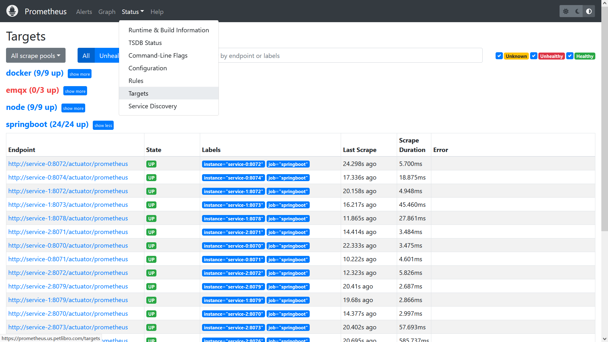
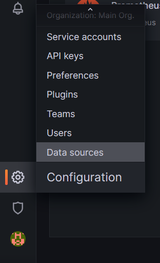
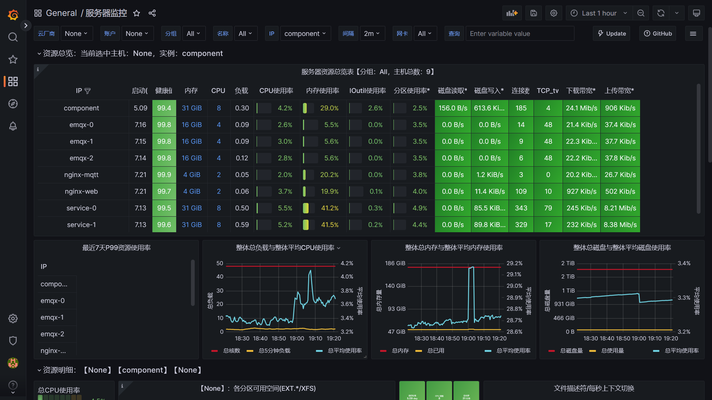
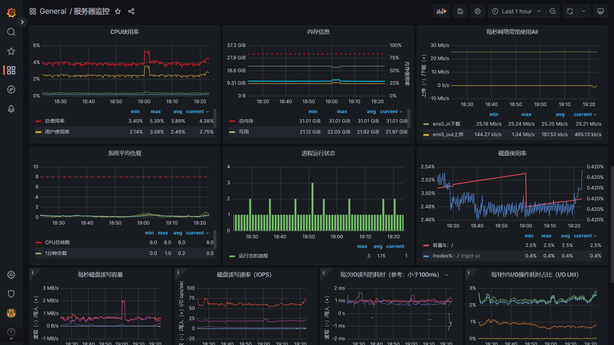
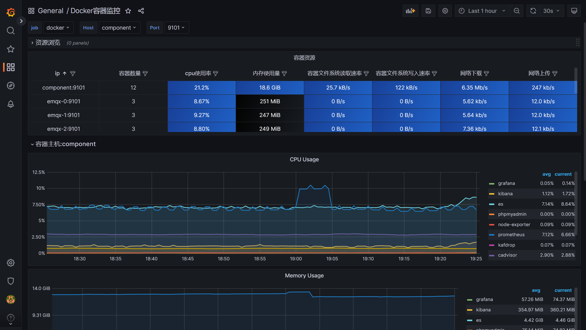
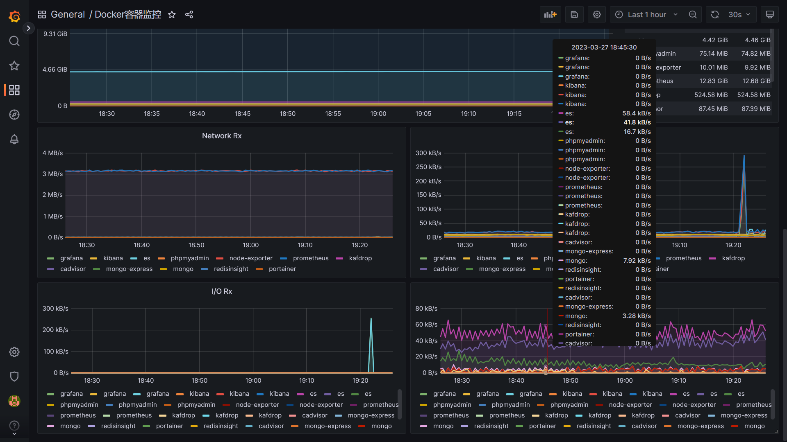
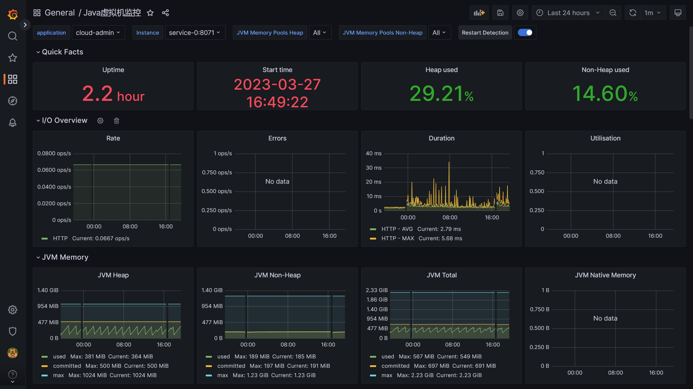
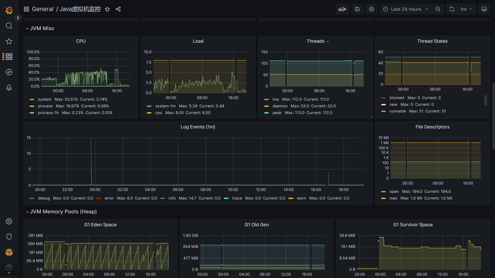

### 组件架构


- Prometheus：作为整个监控系统的核心，提供数据存储，数据查询等功能。
- Exporter：采集器，有很多种类，如操作系统的采集器、Docker容器的采集器、MySQL的采集器等。Exporter主动去采集数据，然后Prometheus再从Exporter进行数据拉取和存储。
- PushGateway：也是采集器，但是和Exporter的区别是，PushGateway是对应的服务主动将监控数据推送到PushGateway，然后PushGateway再推送到Prometheus。而Exporter是主动去采集的。一个攻一个受，一个拉一个推。
- Grafana：显示面板，采集完存储在Prometheus的数据，需要进行显示，Prometheus自带的面板不好用。Grafana的显示面板种类很多，而且社区丰富，很容易找到适合自己的显示面板。
- AlertManager：采集完成的数据，要是不正常，我们一般会希望最好能告下警，AlertManager就是用来做告警的。


### Exporter部署
我们先从数据采集的源头开始讲起。

Exporter的种类有很多，如操作系统的采集器，Docker容器的采集器，MySQL、Nginx、ElasticSearch和Java-SpringBoot的采集器等等。而采集器的实现也很简单，根据配置的间隔，主动去采集数据，然后等Prometheus来拉取就行了。

Exporter负责数据的采集，而被采集的对象，**本身需要提供能被采集的数据**。一般比较出名的开源仓库，都提供相应的监控功能，如Spring的actuator的组件。

我们先从操作系统的Exporter进行采集。

#### Node-Exporter

操作系统和部署的机器，在云计算中习惯上被称之为node，表示一个个节点。

Node-Exporter就是用来采集操作系统的Exporter，以Docker部署为例：

```shell
docker run -d \
    --net=host \
    --restart=always \
    --name=node-exporter \
    -v /:/rootfs \
    -v /sys:/host/sys \
    -v /proc:/host/proc \
    bitnami/node-exporter:latest --path.procfs /host/proc --path.sysfs /host/sys --collector.filesystem.ignored-mount-points "^/(sys|proc|dev|host|etc)($|/)"
```

操作系统将其系统的一些信息，保存在磁盘的目录上。 因为我们是容器化部署，所以需要将存有操作系统信息的目录挂载到容器中。

命令中的`-v`就是将操作系统的相关监控数据，挂载到Node-Exporter容器的目录上，然后再在启动命令中指定监控，`--path.procfs`等。

`--net`则表示与宿主系统使用同一网络，方便监控网络相关的数据。

这里我用的镜像是bitnami的镜像，用其他的镜像其实也差不多。

命令执行完后，可以通过http协议请求Node-Exporter的接口，查看是否部署成功。默认的端口是9100，也可以通过加上`--web.listen-address=:`的启动参数指定，如`--web.listen-address=:9100`
```shell
curl localhost:9100/metrics
```


如果出现下面的一大堆信息，说明部署和监控基本是OK的。
```shell
root@VM-24-13-ubuntu:~# curl localhost:9100/metrics
# HELP go_gc_duration_seconds A summary of the pause duration of garbage collection cycles.
# TYPE go_gc_duration_seconds summary
go_gc_duration_seconds{quantile="0"} 2.2753e-05
go_gc_duration_seconds{quantile="0.25"} 2.5187e-05
go_gc_duration_seconds{quantile="0.5"} 2.679e-05
go_gc_duration_seconds{quantile="0.75"} 3.5396e-05
go_gc_duration_seconds{quantile="1"} 9.3394e-05
go_gc_duration_seconds_sum 0.125801731
go_gc_duration_seconds_count 4270
# HELP go_goroutines Number of goroutines that currently exist.
# TYPE go_goroutines gauge
go_goroutines 8
...
```


#### Docker-Exporter

Docker容器的采集，是谷歌提供的组件，叫做cAdvisor。Docker是谷歌开源出来的，谷歌肯定最清楚怎么对Docker的容器进行监控呀。

```shell
docker run -d \
    --name=cadvisor \
    -p 9101:8080 \
    --restart=always \
    --device=/dev/kmsg \
    --privileged \
    -v /:/rootfs:ro \
    -v /var/run:/var/run:rw \
    -v /sys:/sys:ro \
    -v /data/docker:/var/lib/docker:ro \
    -v /dev/disk/:/dev/disk:ro \
    google/cadvisor
```

因为是对Docker容器进行数据采集，不需要与宿主系统共用同一个网络，所以我给他指定了一个端口9101，`-p 9101:8080`。

cAdvisor也可以对宿主系统进行一些监控，所以可以看到`-v /:/rootfs:ro`，将整个宿主系统的数据挂载到了容器中。

另外还将`--device=/dev/kmsg`宿主系统的设备信心挂载了进去，还对宿主系统的设备做了一些监控。

其他的`-v`就是一些监控数据的挂载了，需要注意的是`-v /data/docker:/var/lib/docker:ro`，表示将docker服务的数据目录挂载了进去。默认的docker数据目录是`/var/lib/docker`。

因为我在`/etc/docker/daemon.json`中改成了`/data/docker`，所以我得挂载是`-v /data/docker:/var/lib/docker:ro`。这点需要**特别注意**。


和Node-Exporter一样，也可以通过http请求来验证是否部署成功，注意端口需要改成映射的端口。
```shell
curl localhost:9101/metrics
```

出现如下的信息说明部署成功
```shell
root@VM-24-13-ubuntu:~# curl localhost:9101/metrics
# HELP cadvisor_version_info A metric with a constant '1' value labeled by kernel version, OS version, docker version, cadvisor version & cadvisor revision.
# TYPE cadvisor_version_info gauge
cadvisor_version_info{cadvisorRevision="8949c822",cadvisorVersion="v0.32.0",dockerVersion="20.10.21",kernelVersion="5.4.0-139-generic",osVersion="Alpine Linux v3.7"} 1
# HELP container_cpu_cfs_periods_total Number of elapsed enforcement period intervals.
# TYPE container_cpu_cfs_periods_total counter
container_cpu_cfs_periods_total{container_label_org_opencontainers_image_base_name="",container_label_org_opencontainers_image_created="",container_label_org_opencontainers_image_description="",container_label_org_opencontainers_image_licenses="",container_label_org_opencontainers_image_ref_name="",container_label_org_opencontainers_image_title="",container_label_org_opencontainers_image_vendor="",container_label_org_opencontainers_image_version="",id="/YunJing",image="",name=""} 7436
...
```


#### Actuator-Exporter
Spring的Actuator组件，就是用来做监控的。集成了Actuator组件之后，就不需要额外的Exporter了。

如果是SpringBoot的项目，那么添加一下Actuator的依赖，就能直接支持监控了，非常方便。Spring项目的福音。如maven：
```shell
<dependency>
    <groupId>org.springframework.boot</groupId>
    <artifactId>spring-boot-starter-actuator</artifactId>
    <version>3.0.4</version>
</dependency>
```

或者Gradle：
```shell
implementation 'org.springframework.boot:spring-boot-starter-actuator:3.0.4'
```

Actuator默认的请求地址是`ip:port/actuator/prometheus`，如：
```shell
curl localhost:8070/actuator/prometheus
```

出现一下信息说明部署成功
```shell
root@service-0:~# curl localhost:8070/actuator/prometheus
# HELP jvm_gc_memory_allocated_bytes_total Incremented for an increase in the size of the (young) heap memory pool after one GC to before the next
# TYPE jvm_gc_memory_allocated_bytes_total counter
jvm_gc_memory_allocated_bytes_total{application="cloud-gateway",} 1.1533287424E10
# HELP jvm_classes_unloaded_classes_total The total number of classes unloaded since the Java virtual machine has started execution
# TYPE jvm_classes_unloaded_classes_total counter
jvm_classes_unloaded_classes_total{application="cloud-gateway",} 0.0
# HELP jvm_memory_max_bytes The maximum amount of memory in bytes that can be used for memory management
# TYPE jvm_memory_max_bytes gauge
...
```


### Prometheus部署

Exporter部署完，就该部署Prometheus进行数据拉取和查询了。

也是使用Docker部署Prometheus，也是使用bitnami的镜像。需要先给挂载的目录授下权。
```shell
chown -R 1001 /data/prometheus
```


启动Prometheus。
```shell
# net=host表示将hosts的文件写进去
docker run -d \
    -p 9090:9090 \
    --net=host \
    --restart=always \
    --name=prometheus \
    -v /data/prometheus/conf/prometheus.yml:/opt/bitnami/prometheus/conf/prometheus.yml \
    -v /data/prometheus/data:/opt/bitnami/prometheus/data \
    bitnami/prometheus:latest
```

Prometheus默认的端口是`9090`，启动的时候也是默认端口就好了。

`-v`中，`/data/prometheus/conf/prometheus.yml`表示Prometheus的配置文件，将配置好的文件挂载容器内。`/data/prometheus/data`，则将一些监控数据挂载到磁盘中，方便可能得扩磁盘等。


`prometheus.yml`具体的配置如下：
```yaml
global:
  scrape_interval: 15s 
  evaluation_interval: 15s 
alerting:
  alertmanagers:
    - static_configs:
        - targets:

rule_files:
  
scrape_configs:
  - job_name: "node"
    static_configs:
      - targets: ["192.168.x.x:9100"]
  - job_name: "docker"
    static_configs:
      - targets: ["192.168.x.x:9101"]
```

- `scrape_interval`和`evaluation_interval`表示采集的间隔，默认15秒就好了，监控主要是看个趋势而已。
- `alerting` //todo
- `scrape_configs`，则表示exporter的配置，因为我想node、docker、java服务的监控分开来，所以我分成了三个job
  - job_name：自己写的名字，随意
  - static_configs.targets：表示采集的ip和端口。

启动完成之后，可以在【Status】->【Targets】中看到exporter的采集信息，如：


状态up的话，说明采集是成功的。


### Grafana部署

#### 部署
由于核心的监控数据都在Prometheus节点上，Grafana只是个面板，负责好看就行，所以部署很简单。

`-p`指定一下端口，`-v`指定一下存储相关的数据挂载即可。
```shell
docker run -d \
    --name=grafana \
    --restart=always \
    -p 3000:3000 \
    -v /data/grafana:/var/lib/grafana \
    grafana/grafana
```

完成部署后，通过默认的3000端口即可访问。

数据源的添加也很简单，在齿轮图标点击一下【Data Source】，填写Prometheus的IP端口即可。


面板的话，觉得大多大同小异，提供一下我选择的面板ID，大家参考一下即可。

#### Node-Exporter面板
**面板Id：8919**

- 提供多服务器的概览信息
- 提供单台服务器的CPU、内存、磁盘、网卡、连接数等相关信息




#### Docker-Exporter面板
**面板Id：13631**

- 提供多服务器Docker的概览信息
- 提供单台服务器的Docker容器CPU、内存、网络、IO等简要信息




#### Actuator-Exporter面板
**面板Id：13694**

- 提供堆内存、直接内存的使用信息
- 提供垃圾回收的信息




