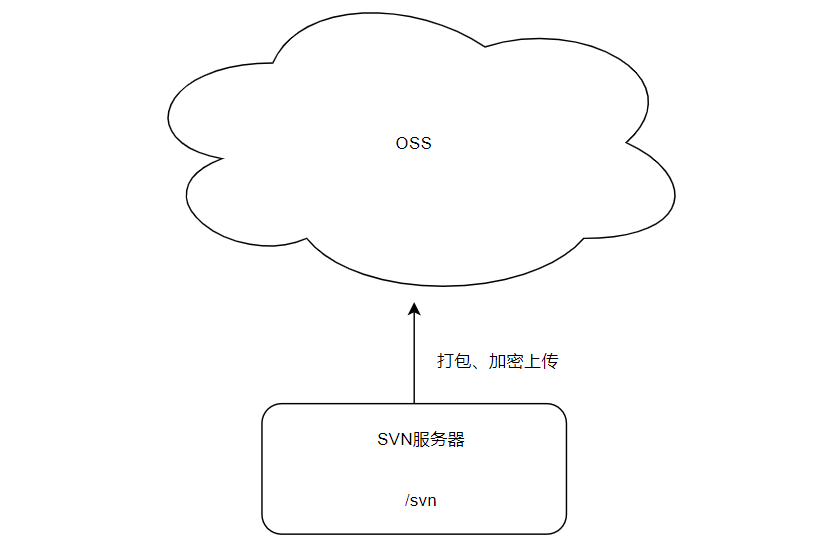
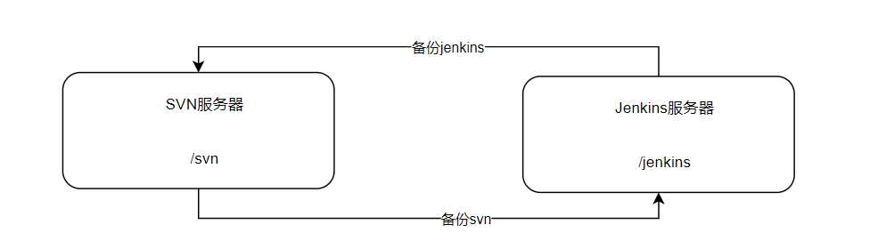
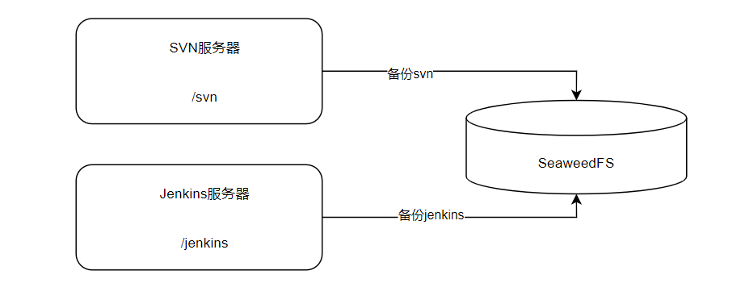

### 备份方法

#### OSS方式

将数据打包、加密，然后上传到云服务商的对象存储系统（Object Store System）中。

优点：

- 方案简单，易于实现
- 云存储的数据可靠性较高

缺点：

- 需要开通OSS账号，存在备份的费用
- 走外网带宽，适用于小文件备份

#### 双机互拷

将一台服务器的数据打包，然后拷贝到另外的服务器上。

优点：

- 不需要额外的投入
- 充分利用已有服务器的磁盘资源

缺点：

- 服务器磁盘不足时，无法使用此方案

#### SeaweedFS

挂载swfs到服务器，将服务器的数据打包，直接存到swfs中

优点：

- 不需要额外投入
- 充分利用SeaweedFS的存储资源

缺点：

- SeaweedFS如果频繁升级或者不稳定，可能会导致备份的文件丢失，或者无法备份
- 备份的服务器太多时，Seaweed的存储资源可能会不大够用

### 备份策略

#### 根据时间备份

根据数据的重要程度和数据量，可以分为一天备份一次、一周备份一次、一个月备份一次等等

如SVN的数据比较重要，并且数据量只有300G，可以一天备份一次+一周备份一次，组合备份

如Jenkins的数据基本不会有大的变化，可以一天备份一次+一个月备份一次，组合备份

如Nexus的数据量很大，那么一周或一个月备份一次即可

如Gitlab的数据非常重要，那么应该一天、一周、一月都进行备份，确保数据丢失时，损失最小

